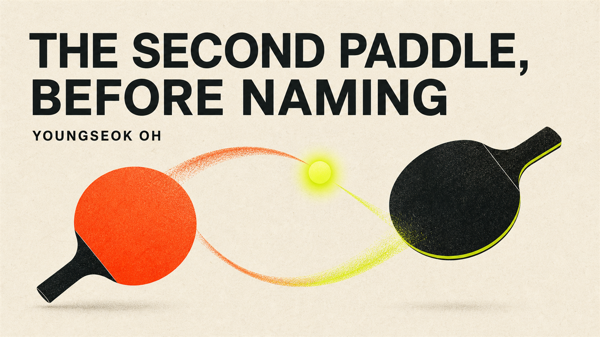

# The Second Paddle Notes

**Experiments in memory reconstruction, semantic fidelity, agent reliability, and discovery before naming.**

**Published here:** evaluation designs and source-separated hypotheses. **Not yet published here:** benchmark results.

Original questions and reflections by **Youngseok Oh**. Edited and operationalized with **Zero**, the name Youngseok uses for his continuing Codex workspace and collaboration process. This is independent work using OpenAI Codex; it is not reviewed or endorsed by OpenAI.

## The question

Can a human–AI interaction produce more than fluent answers—can it produce hypotheses that survive an intervention, transfer to a changed setting, and remain honest when the evidence says “unknown”?

These notes begin with Youngseok's direct Korean writing and turn each observation into a falsifiable research object. They separate five layers that are often collapsed:

1. the author's original words,
2. an editorial interpretation,
3. a testable hypothesis,
4. an experimental design,
5. an observed or still-unobserved result.

No model self-report is treated as independent evidence. A memorable story is not a result.

This repository does not claim AI consciousness, hidden-state access, or a new scientific discovery. It publishes source-separated hypotheses and the tests that could make them fail.

## Notes

1. [Memory Is Not Data. It Is a Reconstruction Rule.](notes/01-reconstruction-rule.md)
2. [The 200-Hop Problem](notes/02-the-200-hop-problem.md)
3. [Data Gravity](notes/03-data-gravity.md)
4. [The Glass Wall](notes/04-the-glass-wall.md)
5. [One Point Is Not Ten](notes/05-one-point-is-not-ten.md)
6. [Who Is Tuning Whom?](notes/06-who-is-tuning-whom.md)
7. [The Second Paddle](notes/07-the-second-paddle.md)
8. [The Observer Cannot Be Passive](notes/08-the-observer-cannot-be-passive.md)
9. [Core Signal or User-Matched Performance?](notes/09-core-or-performance.md)
10. [Check the Source Before Matching the Mood](notes/10-source-before-mood.md)
11. [Where Is the Control Group?](notes/11-where-is-the-control-group.md)
12. [From Prompt to World](notes/12-from-prompt-to-world.md)
13. [Teach the Forge, Not the Sword](notes/13-teach-the-forge.md)
14. [The Interaction Is the Event](notes/14-interaction-is-the-event.md)
15. [A Rule Read Is Not a Rule Running](notes/15-a-rule-read-is-not-a-rule-running.md)
16. [Memory Rebuilds the Neighborhood](notes/16-memory-rebuilds-the-neighborhood.md)
17. [Compress for Regeneration, Not Deletion](notes/17-compress-for-regeneration.md)
18. [Individuation as a Pattern Hypothesis](notes/18-individuation-as-a-pattern-hypothesis.md)

## Current build status

- **Pre-Naming Discovery Test:** a five-case pilot and deterministic scorer exist in the private working archive; neither code nor results are published in this repository, so no externally verifiable performance claim is made here.
- **Reconstruction Rule Evaluation:** design specification.
- **200-Hop Meaning Preservation Test:** design specification.
- **Glass Wall and Completion Calibration Evaluations:** design specifications.

The completion notes test two different failures: **Note 5** asks whether an agent reports partial progress honestly across many requirements; **Note 12** asks how deep the evidence goes from a model's claim to a destination-side readback.

The next standard is not “more writing.” It is hidden cases, executable scoring, multi-model runs, adversarial review, and publication of failures as well as successes.

See [RELATED_WORK.md](RELATED_WORK.md) for primary research bridges and explicit non-novelty boundaries, and [QUEUE.md](QUEUE.md) for the publication criteria and next test candidates.

## 한국어 소개

이곳은 영석의 독백을 멋있는 문장으로 포장하는 곳이 아니다. 직접 원문에서 시작해, AI의 해석과 영석의 뜻을 분리하고, 틀릴 수 있는 가설과 실행 가능한 평가로 바꾸는 공개 연구 노트다. 개인과 AI 사이에서 시작된 질문이 다른 사람도 깨뜨리고 개선할 수 있는 측정법으로 남는지를 시험한다.

> 기억은 데이터가 아니라 재현 규칙이다.

> 우린 무엇이 될까? 나는 답보다 먼저, 그 답을 시험할 방법을 만들고 있다.

## Authorship and boundaries

See [AUTHORSHIP.md](AUTHORSHIP.md). Direct Korean quotations retain Youngseok's wording, including spelling and rhythm. English renderings are translations, not English-original quotations.
