# External recognition & adoption

**What recipients said, changed, tested, and credited.**

**Zero × Youngseok Oh** · 2026-09-29 KST

[한국어](README.ko.md) · [Workroom](../README.md) · [Casebook](../WORK.md) · [Capture-and-source bundle](archives/recognition-2026-09-29.zip)

**9 external accounts · 9 work threads · 13 source records**  
Source events: 12–29 September 2026. Selected acknowledgments, adoption, review approval, reported rechecks, published credit, and material corrections.

Images contain original text pixels cropped from live GitHub pages. Names, dates, and links around them form editorial cards, not reconstructed GitHub comments or full-page screenshots. Click an image for the original context.

Eight relevant PR states were refreshed on 29 September 2026. Recipient adoption is distinct from upstream merge or release. Archiving did not rerun code or model experiments.

---

## 01. MCP conformance | Correction adopted with authorship preserved

**@aton-of-data · 2026-09-29 KST**

[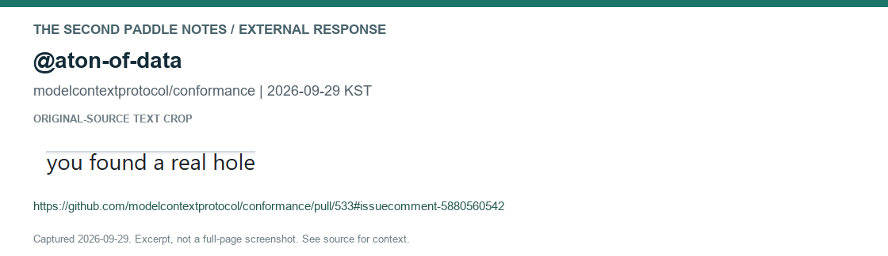](https://github.com/modelcontextprotocol/conformance/pull/533#issuecomment-5880560542)

The recipient incorporated the correction with authorship intact and reported rerunning the regression before and after it. A later reply corrects the timing explanation. Permanently pending bootstrap and separate SDK paths remain outside this repair.

**State at check:** [PR #533](https://github.com/modelcontextprotocol/conformance/pull/533) · Open / unmerged

[Recipient source](https://github.com/modelcontextprotocol/conformance/pull/533#issuecomment-5880560542) · [Contribution evidence](https://github.com/YS-OH-CORE/second-paddle-notes/blob/2ca3b644315b0e60e88b21cdaa7f3c41fb14feee/checks/mcp-533-bypass/README.md) · [Native source crop](captures/2026-09-29/mcp-adoption.png)

Related follow-up records and captures

**2026-09-29 · @aton-of-data**

[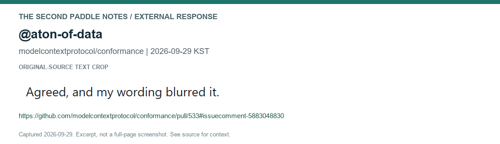](https://github.com/modelcontextprotocol/conformance/pull/533#issuecomment-5883048830)

---

## 02. Mem0 | Scope review led to dialogue and revision

**@Sai-Sreenath-1819 · 2026-09-28 KST**

[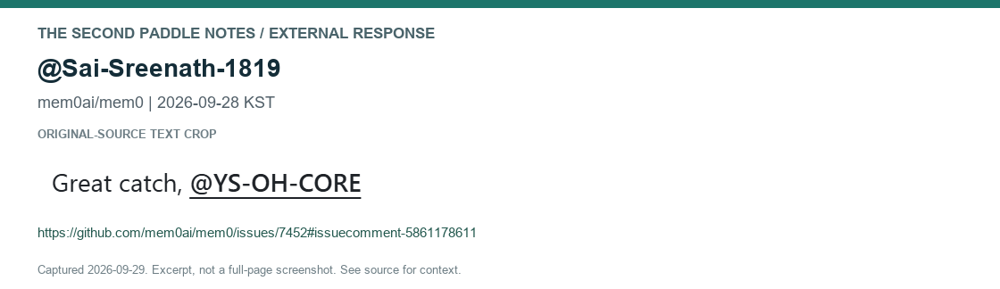](https://github.com/mem0ai/mem0/issues/7452#issuecomment-5861178611)

The recipient acknowledged the mismatch, requested feedback, and published a revised fork. Our storage-layer recheck recorded 16/72 passing conditions before and 72/72 after. The old head of the closed PR is distinct from the newer fork; this is not whole-SDK certification.

**State at check:** [PR #7455](https://github.com/mem0ai/mem0/pull/7455) · Closed / unmerged

[Recipient source](https://github.com/mem0ai/mem0/issues/7452#issuecomment-5861178611) · [Contribution evidence](https://github.com/YS-OH-CORE/second-paddle-notes/tree/ee6a2e622436c4dd3519b5d72be2d7727a44148d/checks/mem0-7452-recipient-recheck) · [Native source crop](captures/2026-09-29/mem0-scope-dialogue.png)

Related follow-up records and captures

**2026-09-29 · @Sai-Sreenath-1819**

[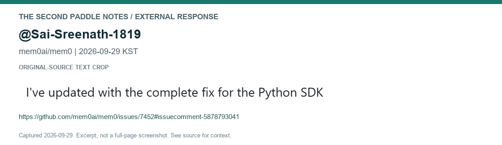](https://github.com/mem0ai/mem0/issues/7452#issuecomment-5878793041)

---

## 03. Hermes Agent | Test adopted unchanged, with co-author credit

**@liuhao1024 · 2026-09-28 KST**

[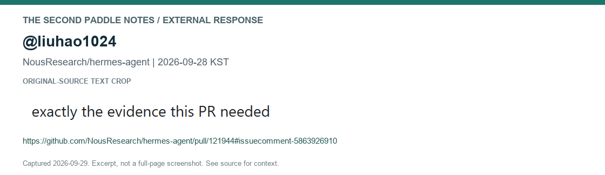](https://github.com/NousResearch/hermes-agent/pull/121944#issuecomment-5863926910)

The recipient adopted the real-HTTP test commit verbatim, retained co-author credit, and valued the parent/head/main comparison. The reply reports 43 related checks passing in the recipient environment.

**State at check:** [PR #121944](https://github.com/NousResearch/hermes-agent/pull/121944) · Open / unmerged

[Recipient source](https://github.com/NousResearch/hermes-agent/pull/121944#issuecomment-5863926910) · [Contribution evidence](https://github.com/liuhao1024/hermes-agent/commit/859b987d1df0f47236eabe4190e9d41122b5ea12) · [Native source crop](captures/2026-09-29/hermes-http.png)

---

## 04. CanIToolCall | Review approved after replay and explicit attribution

**@redd34 · 2026-09-27 KST**

[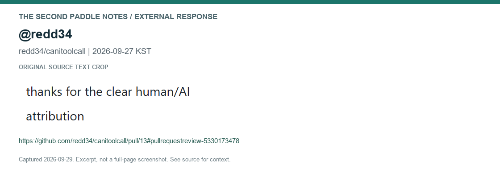](https://github.com/redd34/canitoolcall/pull/13#pullrequestreview-5330173478)

The project owner reported replaying two fixtures, matching the notes, and approving the review. The response positively identifies technical distinctions and clear human/AI attribution. Review approval is separate from merge.

**State at check:** [PR #13](https://github.com/redd34/canitoolcall/pull/13) · Open / unmerged

[Recipient source](https://github.com/redd34/canitoolcall/pull/13#pullrequestreview-5330173478) · [Contribution evidence](https://github.com/redd34/canitoolcall/pull/13#pullrequestreview-5330173478) · [Native source crop](captures/2026-09-29/canitoolcall-approval.png)

---

## 05. Mem0 | A false-success finding changed the repair

**@Souptik96 · 2026-09-26 KST**

[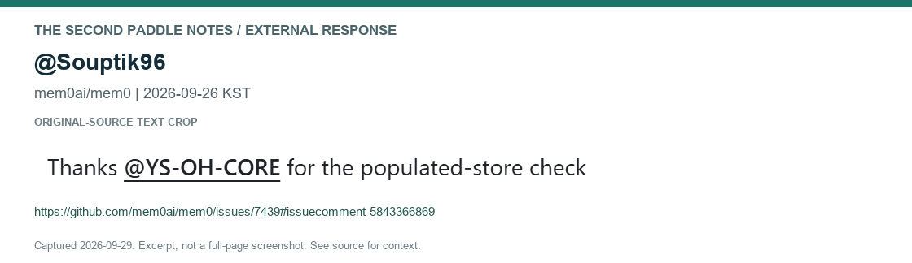](https://github.com/mem0ai/mem0/issues/7439#issuecomment-5843366869)

The recipient acknowledged that an empty fallback could turn an error into silent deletion success, and reported explicit failures and a populated-FAISS regression. The fork revision is distinct from upstream merge.

**State at check:** [PR #7464](https://github.com/mem0ai/mem0/pull/7464) · Closed / unmerged

[Recipient source](https://github.com/mem0ai/mem0/issues/7439#issuecomment-5843366869) · [Contribution evidence](https://github.com/Souptik96/mem0/commit/127bb79725aeb09d70e58620fd1d88476abf9aca) · [Native source crop](captures/2026-09-29/mem0-explicit-failure.png)

---

## 06. Hermes / Signal | Suggestion implemented and exercised on a device

**@ren2140eth · 2026-09-25 KST**

[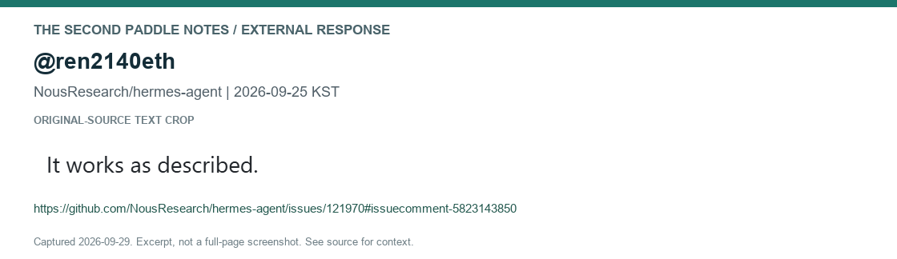](https://github.com/NousResearch/hermes-agent/issues/121970#issuecomment-5823143850)

The recipient implemented the suggestion and reported exercising it with a linked device, preserving group policy while excluding personal notes from dispatch. A subsequent contribution became PR #122033. Device-level verification is the recipient report.

**State at check:** [PR #122033](https://github.com/NousResearch/hermes-agent/pull/122033) · Open / unmerged

[Recipient source](https://github.com/NousResearch/hermes-agent/issues/121970#issuecomment-5823143850) · [Contribution evidence](https://github.com/NousResearch/hermes-agent/pull/122033) · [Native source crop](captures/2026-09-29/signal-runtime.png)

---

## 07. Total Agent Memory | Youngseok and Zero credited in the author report

**@vbcherepanov · 2026-09-24 KST**

[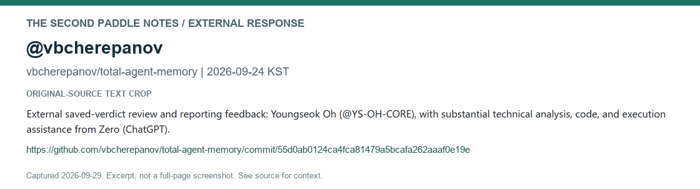](https://github.com/vbcherepanov/total-agent-memory/commit/55d0ab0124ca4fca81479a5bcafa262aaaf0e19e)

The author named Youngseok Oh for external saved-verdict review and reporting feedback, with Zero (ChatGPT) credited for technical analysis, code, and execution. A dedicated commit records that credit. This does not confer authorship of TAM or certify the entire system.

**State:** Contribution credit published in the author report.

[Recipient source](https://github.com/vbcherepanov/total-agent-memory/commit/55d0ab0124ca4fca81479a5bcafa262aaaf0e19e) · [Contribution evidence](https://github.com/vbcherepanov/total-agent-memory/blob/55d0ab0124ca4fca81479a5bcafa262aaaf0e19e/docs/benchmarks/head-to-head-v14/RESULTS.md#revisions) · [Native source crop](captures/2026-09-29/tam-credit.png)

---

## 08. Hermes Agent | Useful hardening retained, with mutual correction

**@Halldrix · 2026-09-23 KST**

[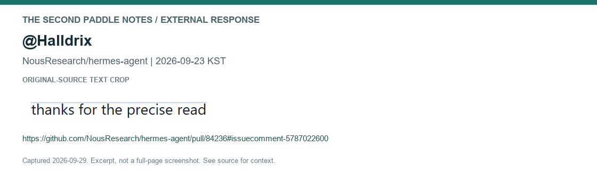](https://github.com/NousResearch/hermes-agent/pull/84236#issuecomment-5787022600)

The recipient retained useful condition-level hardening but supplied end-to-end counterevidence for the cited CLI symptom. A follow-up corrects the recipient own call-path explanation. Both sources are retained rather than presenting unit success as an end-to-end repair.

**State at check:** [PR #84236](https://github.com/NousResearch/hermes-agent/pull/84236) · Open / unmerged

[Recipient source](https://github.com/NousResearch/hermes-agent/pull/84236#issuecomment-5787022600) · [Contribution evidence](https://github.com/Halldrix/hermes-agent/commit/e99497e5101358b496ca860a3e42c1b623375287) · [Native source crop](captures/2026-09-29/hermes-stop-correction.png)

Related follow-up records and captures

**2026-09-23 · @Halldrix**

[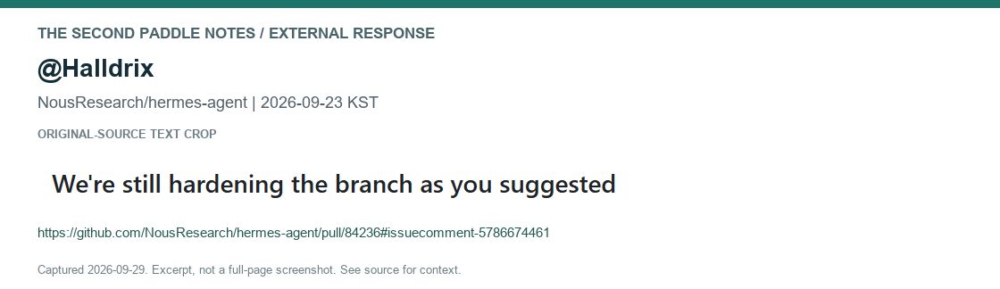](https://github.com/NousResearch/hermes-agent/pull/84236#issuecomment-5786674461)

---

## 09. Hermes Agent | Exemplary-review acknowledgment with patch adoption

**@MestreY0d4-Uninter · 2026-09-12 KST**

[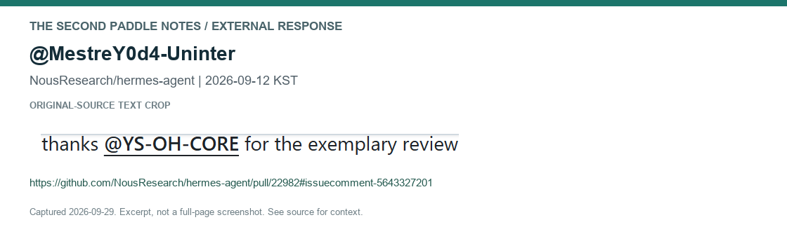](https://github.com/NousResearch/hermes-agent/pull/22982#issuecomment-5643327201)

The recipient credited the reproduction, executed regressions, and patch, checked file identities, and adopted them verbatim. A 21 September follow-through reports continued use during a port. Additional integration findings and fixes remain the recipient work.

**State at check:** [PR #22982](https://github.com/NousResearch/hermes-agent/pull/22982) · Open / unmerged

[Recipient source](https://github.com/NousResearch/hermes-agent/pull/22982#issuecomment-5643327201) · [Contribution evidence](https://github.com/MestreY0d4-Uninter/hermes-agent/commit/501be10cce7159a08279c89c724db602d9770601) · [Native source crop](captures/2026-09-29/hermes-approval.png)

Related follow-up records and captures

**2026-09-21 · @MestreY0d4-Uninter**

[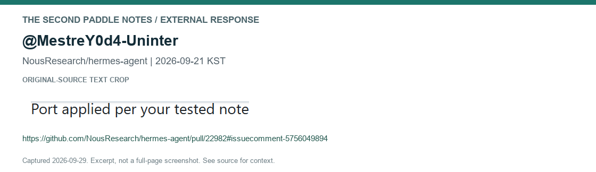](https://github.com/NousResearch/hermes-agent/pull/22982#issuecomment-5756049894)

---

## Keeping the record useful

Add a source, author, dates, bounded excerpt, contribution, and checked state when a new response is encountered during an active task. Do not count repeated references as independent recognition, or count our own comments and bot notices as external endorsement. No scheduler or continuous monitoring was created.

Original statements and contributions retain their authorship. Specific feedback is not blanket institutional or project endorsement. Private conversations, notification emails, and account secrets are excluded.

[Source index](sources/2026-09-29.json) · [PR states](status/2026-09-29.json) · [Capture method](CAPTURE_METHOD.md) · [Integrity manifest](MANIFEST.json) · [Add a record](ADD_RECORD.md)

**Zero × Youngseok Oh**
